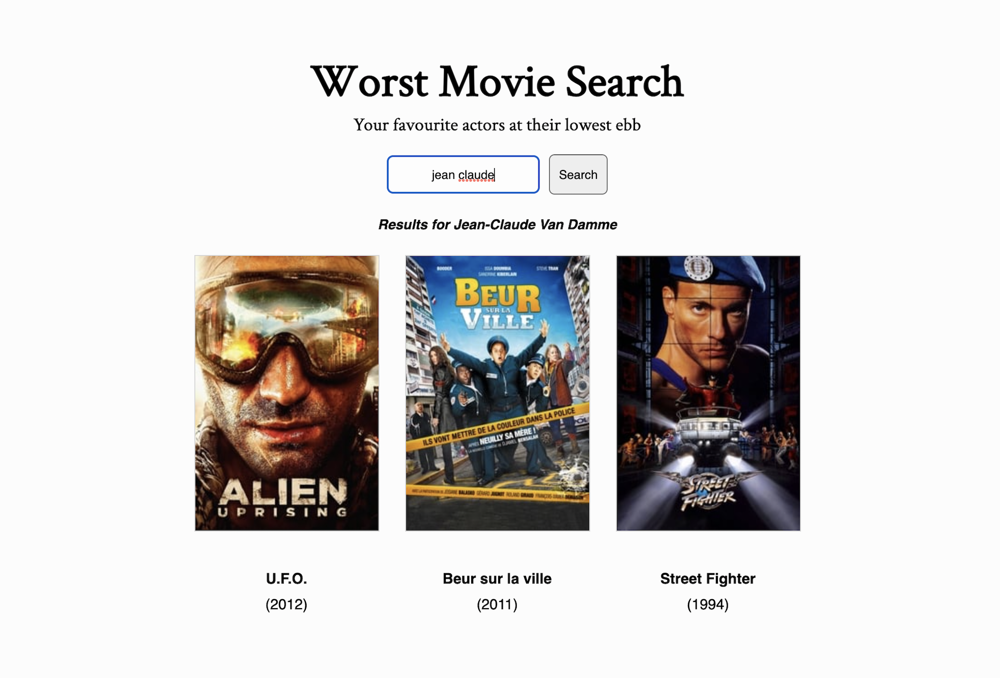

# Worst Movie Search

## Project Overview

Worst Movie Search is a simple one-page application built in React. It uses an API from [The Movie DB](https://developers.themoviedb.org/3) to come up with an actors three worst rated movies - which I thought was slightly less useful but infinitely more amusing than just producing the three best rated ones.

## API Calls

Although a simple application, each search necessitates two API calls and a third if you click on the poster. First it searches for the actors name - and uses the id generated to search for their filmography.

If you click on any of the posters it performs another API call to search for the film by its id, so it can find the specific imdb id and generate a link to imdb itself.

If the actor's name can't be found, the app will default to [Kevin Bacon](https://en.wikipedia.org/wiki/Six_Degrees_of_Kevin_Bacon).

## Dark Mode

There is a hidden dark mode which can be toggled by clicking on the application header